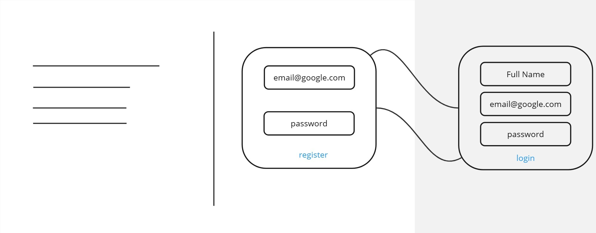
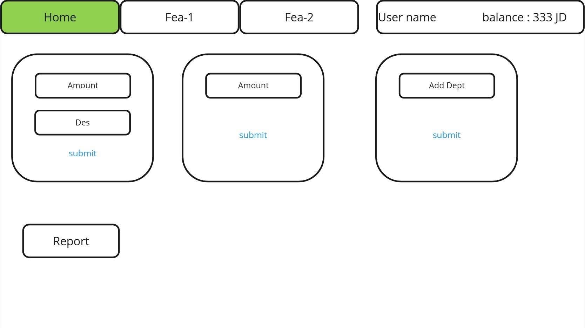
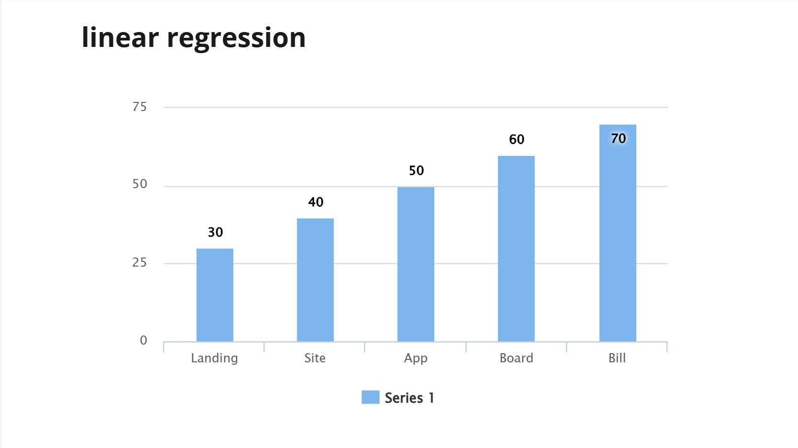
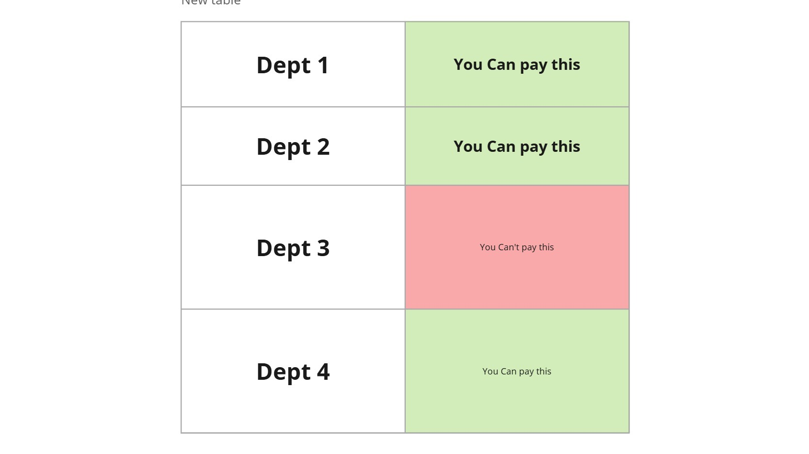
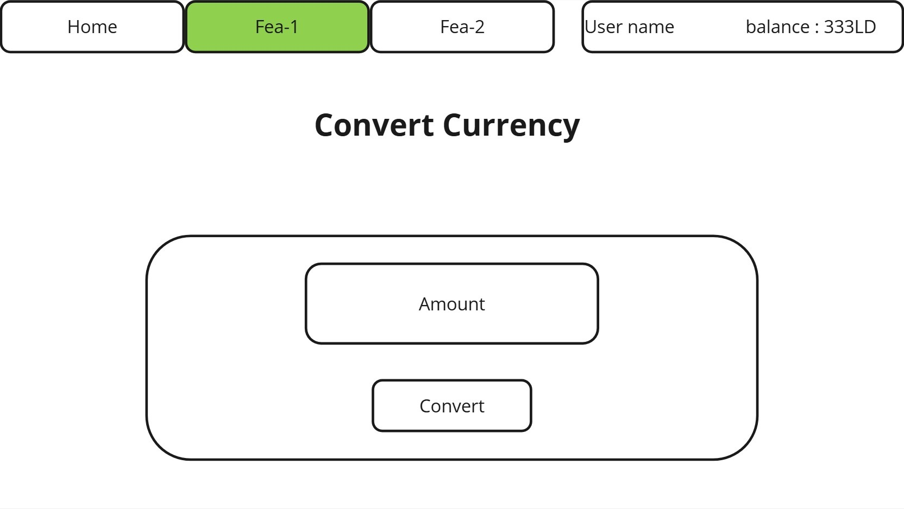
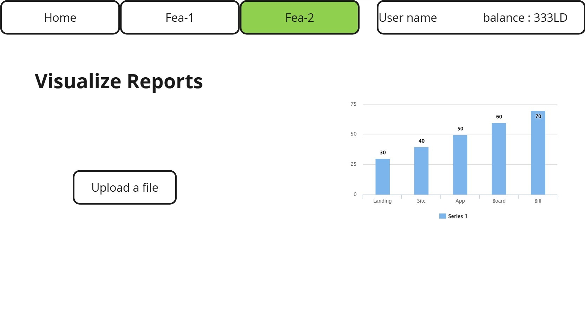
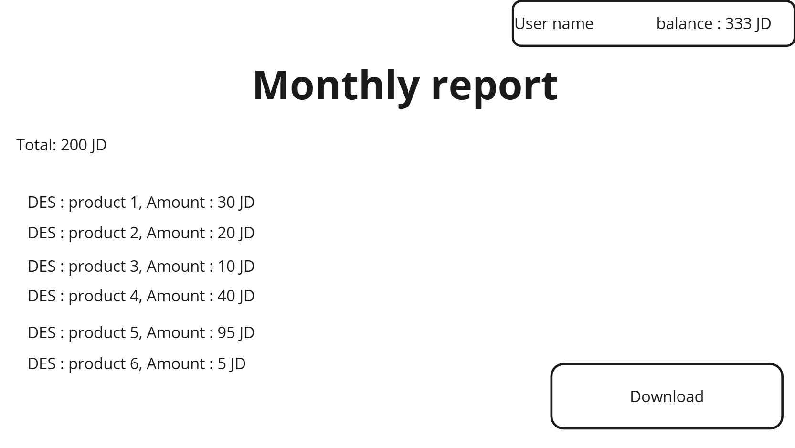

# Finance Manager

## Team Members

- Abdullah kadad
- Balqees Hmoud
- Makarm Abususain
- Mohamed Yaman Katalan
- Raghad Al-Katout

## Project Description

## Installation Instructions

To install and run the Finance-Tracker application, follow these steps:

1. Clone the repository: `git clone git@github.com:Funance-Tracker/Funance-Tracker.git`
2. Navigate to the project directory: `cd Funance-Tracker`
3. Install the required dependencies: `pip install -r requirements.txt`
4. Run the application: `python main.py`

## Usage

## License

This project is licensed under the MIT License. See the LICENSE file for more details.

## Contact Information

For any questions or suggestions, please contact the project maintainers at [@gmail.com].

## Wireframes

